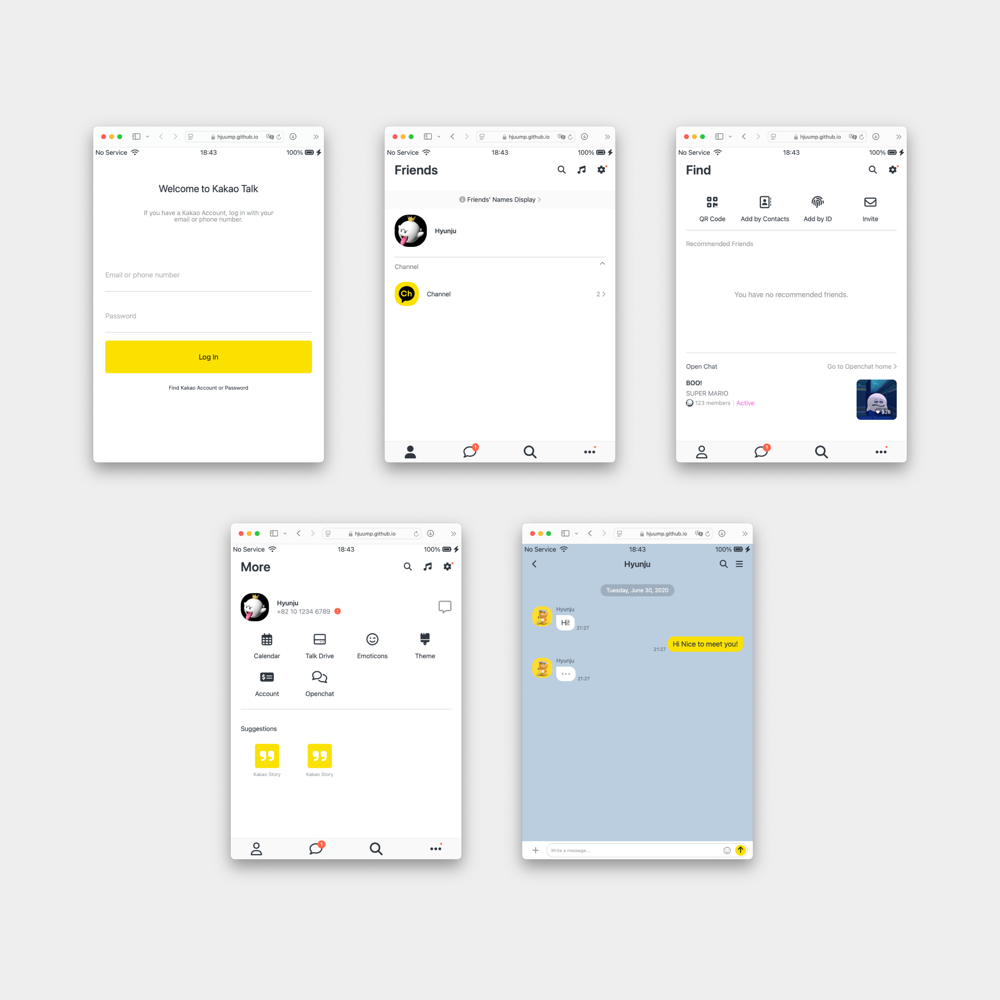

# Kokoa Clone  
A responsive KokoaTalk clone built with HTML and CSS.  
Inspired by the course from [Nomad Coders](https://nomadcoders.co).

## Preview  


## Features  
- Fully responsive design  
- Pixel-perfect replication of KokoaTalk  
- Pure HTML and CSS (no JavaScript)  

## Getting Started  

1. Clone the repository:  
   ```bash  
   git clone https://github.com/your-username/kokoa-clone.git  
